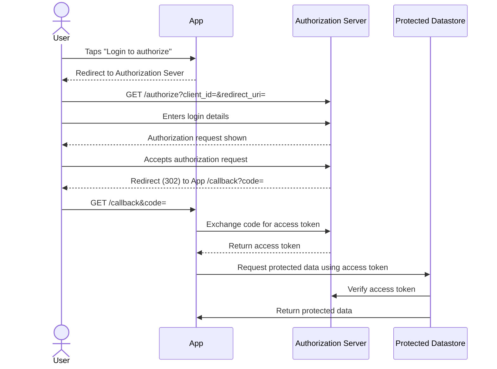

# OAuth Example

Prerequisites:

```
brew install yarn
```


## Authorization Flow


```mermaid
sequenceDiagram
    actor User
    User->>App: Taps "Login to authorize"
    App-->>User: Redirect to Authorization Sever
    User->>Authorization Server: GET /authorize?client_id=&redirect_uri=
    User->>Authorization Server: Enters login details
    Authorization Server-->>User: Authorization request shown
    User->>Authorization Server: Accepts authorization request
    Authorization Server-->>User: Redirect (302) to App /callback?code=
    User->>App: GET /callback&code=
    App->>Authorization Server: Exchange code for access token
    Authorization Server-->>App: Return access token
    App->>Protected Datastore: Request protected data using access token
    Protected Datastore->>Authorization Server: Verify access token
    Protected Datastore->>App: Return protected data
```
